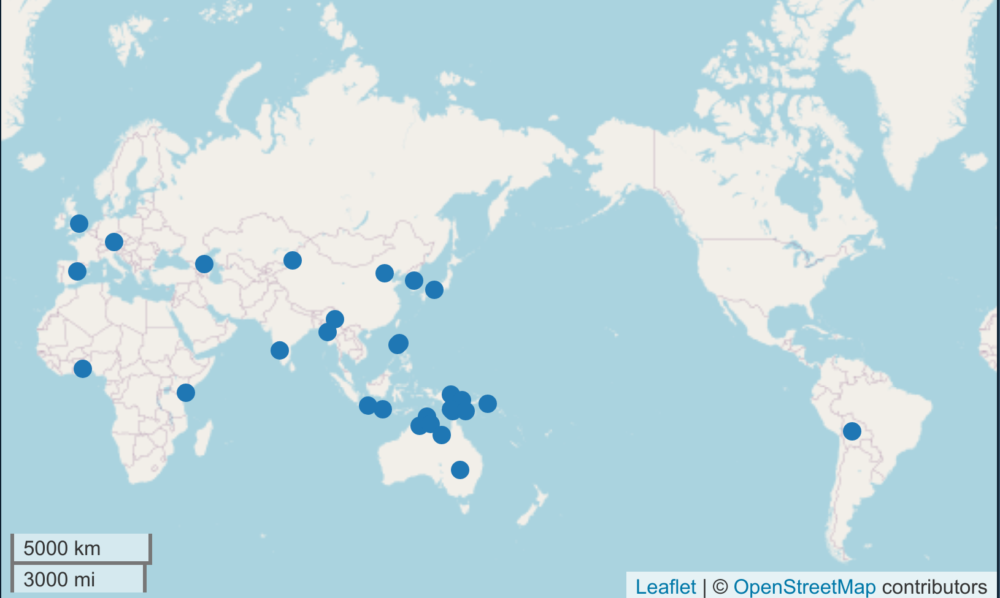
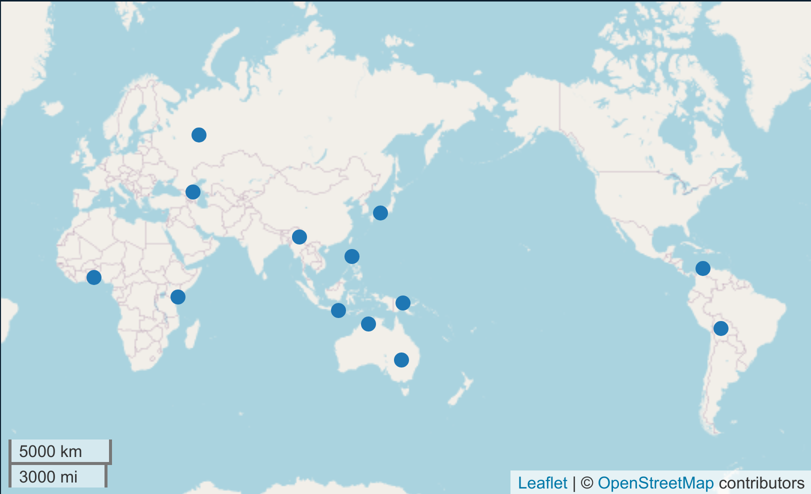
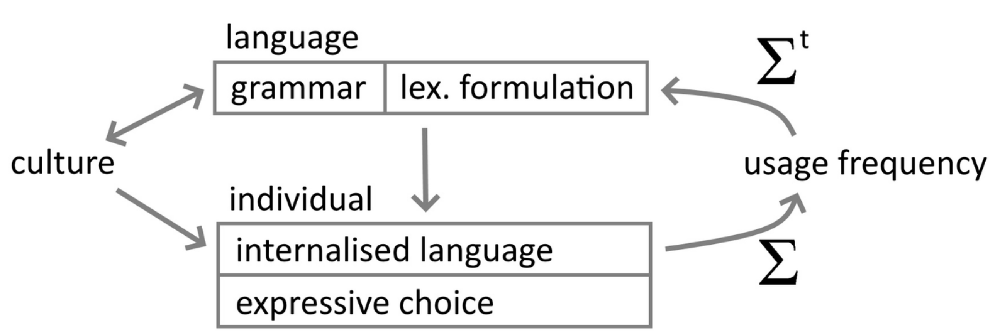

```{r, include=FALSE}
knitr::opts_chunk$set(echo = FALSE, warning = FALSE, message = FALSE, dev='cairo_pdf')
library(tidyverse)
theme_set(theme_bw())
```

# Context of the paper

## Family Problems picture task, [@san12]

This task was developed for a research of the grammaticized expression of **\underline{social cognition}**, that combines

- “social facts” such as kinship relationships;
- “psychological facts” (such as feelings, desires, or attentional states);
- and something else. \pause

Authors wanted to create a task that stimulates production

- of different speech types (descriptions, dialogic interactions, narratives);
- of linguistic expressions relevant to the domain of social cognition;
- of some known interesting grammatical categories (e.g. evidentiality);
- of parallel but spontaneous texts (in the broad sense) across different languages.

## Family Problems picture task, [@san12]

"Two participants (A and B) sit together, either side-by-side or oriented slightly toward each other, with an open flat space (e.g., the ground, a table) in front of
them. The activity involves three components:

(i) the participants are given the pictures one at a time and describe the content of each;
(ii) the participants are asked to arrange the pictures as an ordered narrative, working together;
(iii) participants are asked to tell the story from start to finish, from both third-
person and first-person perspectives, typically to an audience that had not
seen the pictures or heard the story before." [@san12: 144--145]


## Canonical order defined by [@san12]

\centering
```{r, out.width="16%", out.height="21.5%"}
knitr::include_graphics("images/08_garden.jpg", dpi = 100)
knitr::include_graphics("images/06_walk_together.jpg", dpi = 100)
knitr::include_graphics("images/07_drink.jpg", dpi = 100)
knitr::include_graphics("images/04_drunk_gossip.jpg", dpi = 100)
```
```{r, out.width="16%", out.height="21.5%"}
knitr::include_graphics("images/15_about_to_hit.jpg", dpi = 100)
knitr::include_graphics("images/12_punch.jpg", dpi = 100)
knitr::include_graphics("images/09_arrest.jpg", dpi = 100)
knitr::include_graphics("images/05_courtroom.jpg", dpi = 100)
```
```{r, out.width="16%", out.height="21.5%"}
knitr::include_graphics("images/10_think_jail.jpg", dpi = 100)
knitr::include_graphics("images/03_in_jail.jpg", dpi = 100)
knitr::include_graphics("images/16_think_home.jpg", dpi = 100)
knitr::include_graphics("images/02_clothes.jpg", dpi = 100)
```
```{r, out.width="16%", out.height="21.5%"}
knitr::include_graphics("images/14_stand_happy.jpg", dpi = 100)
knitr::include_graphics("images/01_homecoming.jpg", dpi = 100)
knitr::include_graphics("images/13_family_talk.jpg", dpi = 100)
knitr::include_graphics("images/11_refuse_drink.jpg", dpi = 100)
```

## Presentation order defined by [@san12]

\centering
```{r, out.width="16%", out.height="21.5%"}
knitr::include_graphics("images/01_homecoming.jpg", dpi = 100)
knitr::include_graphics("images/02_clothes.jpg", dpi = 100)
knitr::include_graphics("images/03_in_jail.jpg", dpi = 100)
knitr::include_graphics("images/04_drunk_gossip.jpg", dpi = 100)
```
```{r, out.width="16%", out.height="21.5%"}
knitr::include_graphics("images/05_courtroom.jpg", dpi = 100)
knitr::include_graphics("images/06_walk_together.jpg", dpi = 100)
knitr::include_graphics("images/07_drink.jpg", dpi = 100)
knitr::include_graphics("images/08_garden.jpg", dpi = 100)
```
```{r, out.width="16%", out.height="21.5%"}
knitr::include_graphics("images/09_arrest.jpg", dpi = 100)
knitr::include_graphics("images/10_think_jail.jpg", dpi = 100)
knitr::include_graphics("images/11_refuse_drink.jpg", dpi = 100)
knitr::include_graphics("images/12_punch.jpg", dpi = 100)
```
```{r, out.width="16%", out.height="21.5%"}
knitr::include_graphics("images/13_family_talk.jpg", dpi = 100)
knitr::include_graphics("images/14_stand_happy.jpg", dpi = 100)
knitr::include_graphics("images/15_about_to_hit.jpg", dpi = 100)
knitr::include_graphics("images/16_think_home.jpg", dpi = 100)
```

## The Social Cognition Parallax\footnote[frame]{By ‘parallax corpus’ we mean ‘broadly comparable formulations resulting from a comparable task’, to avoid the implications of ‘parallel corpus’ that there will be exact semantic equivalence across languages. (Barth and Evans 2017: 1)} Interview Corpus (SCOPIC)

There are just seven languages in [@san12]. The main drivers of this project (D. Barth and N. Evans) got funding, and as a result in [@barth17] they claimed to have 24 (and over 30 languages now).

- [\alert{corpus website}](https://scopicproject.wordpress.com/);
- recordings and some annotations are available in [\alert{PARADISEC catalog}](http://catalog.paradisec.org.au/collections/SocCog);
- 31 publications including [@barth21].

## The Social Cognition Parallax Interview Corpus (SCOPIC)

30 languages of the database (present in PARADISEC catalog):

```{r, eval = FALSE}
library(tidyverse)
library(lingtypology)
read_delim("Auslan - asf
Arta - atz
Avatime - avn
Bali - ban
Chinese, Mandarin - cmn
Dahalo - dal
Dargwa - dar
German, Standard - deu
Duna - duc
English - eng
Fas - fqs
Iwaidja - ibd
Idi - idi
Ilocano - ilo
Indonesian - ind
Japanese - jpn
Jingpho - kac
Kannada - kan
Korean - kor
Matukar - mjk
Murrinh-Patha - mwf
Burmese - mya
Sibe - nco
Ngalkbun - ngk
Kriol - rop
Xibe - sjo
Spanish - spa
Wára - tci
Tok Pisin - tpi
Yuracare - yuz", delim = " - ", col_names = FALSE) %>% 
  pull(X2) %>% 
  lang.iso() ->
  languages

map.feature(languages)
```

```{r, out.width="95%"}

```

created with `lingtypology`

## The Social Cognition Parallax Interview Corpus (SCOPIC)

13 languages from [@barth21]:

```{r, eval = FALSE}
library(tidyverse)
library(lingtypology)
read_delim("Auslan - asf
Arta - atz
Avatime - avn
Bali - ban
Dalabon - dal
Dargwa - dar
Japanese - jpn
Jingpho - kac
Kogi - kog
Matukar - mjk
Murrinh-Patha - mwf
Russian - rus
Yuracare - yuz", delim = " - ", col_names = FALSE) %>% 
  pull(X2) %>% 
  lang.iso() ->
  languages

map.feature(languages)
```

```{r, out.width="95%"}

```

created with `lingtypology`

# Goal of the paper

## Goal of the paper

The authors make it clear on the second page of the paper:

- "Can we measure the relative contributions of language structures and individual variation to how people formulate statements about the world?
- Do accounts of typological differences need to take individual variation into account, and is such variation more prevalent in some kinds of linguistic domains than others?" [@barth21: 181] \pause

```{r, out.width="90%", fig.cap="Language and individuals affect usage frequency and each other."}

```

# Modeling

## Variation

Imagine some variation pattern (e.g. [pəˈteɪ.toʊ] vs [pəˈtaː.toʊ]).

> - some speakers (Type 1) could use just one variant
> - some speakers (Type 2) can use both variants with some probability... 0.7 of [eɪ]
> - there should be some proportion of speakers of Type 1 (0.3 - [eɪ], 0.1 - [aː]) and Type 2 (0.6)
> - But we don't know anything like this just observe real usage!

## Variation

So we can run some tests, obtain some results and create a language model:

```{r, fig.height=6}
set.seed(42)
data <- sample(c(rbeta(32, 6,4), rbeta(6, 9, 1), rbeta(2, 1, 9)))
fake_data <- sample(c(rbeta(123, 6,4), rbeta(6, 9, 1), rbeta(2, 1, 9)))

beta_est <- fitdistrplus::fitdist(fake_data, distr = 'beta', method = 'mle')

tibble(ratios = data) %>% 
  ggplot(aes(ratios))+
  stat_function(fun = dbeta, args = list(shape1 = beta_est$estimate[1], shape2=  beta_est$estimate[2]), color = "red", size = 2)+
  geom_dotplot()+
  annotate(geom = "label", x = 0.3, y = 1.7, label = "language\nmodel", size = 8)+
  annotate(geom = "segment", x = 0.7, xend = 0.7, y = 2, yend = 0.5,
           arrow = arrow(length = unit(0.3, "cm"), type = "closed"))+
  annotate(geom = "segment", x = 0.5, xend = 0.5, y = 1.5, yend = 0.7,
           arrow = arrow(length = unit(0.3, "cm"), type = "closed"))+
  annotate(geom = "segment", x = 0.6, xend = 0.6, y = 1.8, yend = 0.7,
           arrow = arrow(length = unit(0.3, "cm"), type = "closed"))+
    annotate(geom = "segment", x = 0.8, xend = 0.8, y = 1.6, yend = 0.4,
           arrow = arrow(length = unit(0.3, "cm"), type = "closed"))+
  theme(text = element_text(size = 20))+
  labs(x = "probability of [eɪ]",
       y = "") ->
  p1
p1
``` 

## Variation

We can expect slightly different models for different English dialects:

```{r}
set.seed(42)
data <- sample(c(rbeta(32, 5,5), rbeta(6, 9, 1), rbeta(2, 1, 9)))
fake_data <- sample(c(rbeta(123, 5,5), rbeta(6, 9, 1), rbeta(2, 1, 9)))

beta_est <- fitdistrplus::fitdist(fake_data, distr = 'beta', method = 'mle')

tibble(ratios = data) %>% 
  ggplot(aes(ratios))+
  stat_function(fun = dbeta, args = list(shape1 = beta_est$estimate[1], shape2=  beta_est$estimate[2]), color = "red", size = 2)+
  geom_dotplot()+
  theme(text = element_text(size = 20))+
  labs(x = "probability of [eɪ]",
       y = "") ->
  p2

set.seed(42)
data <- sample(c(rbeta(32, 3,8), rbeta(6, 9, 1), rbeta(2, 1, 9)))
fake_data <- sample(c(rbeta(123, 3,8), rbeta(6, 9, 1), rbeta(2, 1, 9)))

beta_est <- fitdistrplus::fitdist(fake_data, distr = 'beta', method = 'mle')

tibble(ratios = data) %>% 
  ggplot(aes(ratios))+
  stat_function(fun = dbeta, args = list(shape1 = beta_est$estimate[1], shape2=  beta_est$estimate[2]), color = "red", size = 2)+
  geom_dotplot()+
  theme(text = element_text(size = 20))+
  labs(x = "probability of [eɪ]",
       y = "") ->
  p3

set.seed(42)
data <- sample(c(rbeta(32, 8,3), rbeta(6, 9, 1), rbeta(2, 1, 9)))
fake_data <- sample(c(rbeta(123, 8,3), rbeta(6, 9, 1), rbeta(2, 1, 9)))

beta_est <- fitdistrplus::fitdist(fake_data, distr = 'beta', method = 'mle')

tibble(ratios = data) %>% 
  ggplot(aes(ratios))+
  stat_function(fun = dbeta, args = list(shape1 = beta_est$estimate[1], shape2=  beta_est$estimate[2]), color = "red", size = 2)+
  geom_dotplot()+
  theme(text = element_text(size = 20))+
  labs(x = "probability of [eɪ]",
       y = "") ->
  p4

ggpubr::ggarrange(p1, p2, p3, p4)
```

## Modeling in [@barth21]

- In  [@barth21] they use logistic mixed effect regressions:

|   name   |  PREDICT  | fixed ef.    |  random ef.|  random ef.  |
|:--------:|:---------:|:------------:|:----------:|:------------:|
|  *Mod-L* | variation |   language   |            | stimuli card |
| *Mod-LI* | variation |   language   | individual | stimuli card |
|  *Mod-I* | variation |              | individual | stimuli card |

> - Compare models
> - Show model estimates with confidence intervals for the contribution of language

# Domains

## Domains examined

In the paper they examined four domains:

* Propositional framing (grammatical)
* Reported speech, thought, and action constructions (grammatical)
* Reported speech, thought, and action predicates (semantic)
* Human reference lexical choice (semantic)

## Results


# References {.allowframebreaks}
